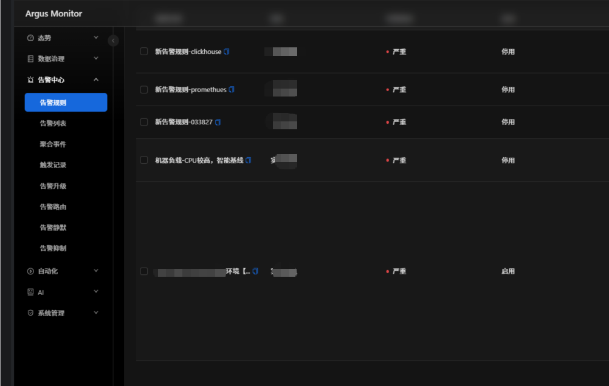
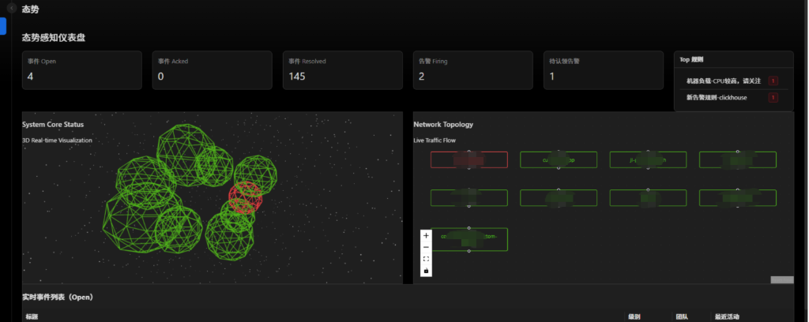
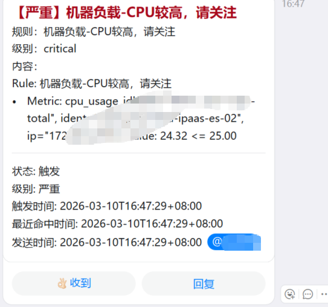
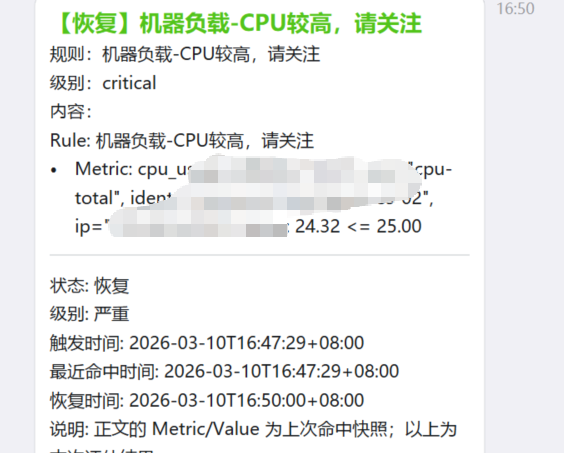

# Argus Monitor

[](LICENSE)

面向多数据源的告警与事件（Incident）平台：提供规则评估、告警路由/静默/抑制/升级、通知通道统一管理、审计与 AI 辅助分析。

English (short): Argus is an alerting & incident platform with routing/silence/inhibit/escalation, multi-datasource querying, multi-channel notifications, audit, and optional AI assistance.

致谢：本项目在产品形态与部分设计思路上借鉴了 frostmourne。

---

## 你可以用它做什么

- **统一告警入口**：Prometheus / SQL（MySQL、SQLServer、ClickHouse）/ Elasticsearch / InfluxDB / SkyWalking 等数据源统一建规则与触发。
- **告警降噪与治理**：支持告警路由（带预览）、静默（时间窗 + matcher）、抑制（源/目标 + equal_labels 关联）、通知冷却、升级策略。
- **触达与联动**：钉钉/飞书/企业微信/Slack/邮件/Webhook 统一通道配置，支持“测试发送”；规则可配置回调地址。
- **事件处置**：告警聚合为 Incident，支持认领/处理/评论/导出，配合 AI Insight/RCA 辅助排障（可选）。
- **安全与审计**：JWT 鉴权、写操作审计、可选响应脱敏、全局 2FA（Google Authenticator，登录时强制绑定）。

### 界面截图

告警规则



态势感知



钉钉通知（触发/恢复）





---

## 功能概览（后端能力）

- 告警规则
  - 创建/编辑/删除、批量启用/禁用、运行态查看、预览、手动触发
  - YAML 导入/导出
- 告警与日志
  - 告警列表、认领/取消认领、处理、批量操作
  - 触发记录（AlertLog）与评估记录（AlertEvalRecord）
- 告警治理
  - 告警路由（Routing Rules）：matcher 下拉提示、预览命中与最终通道
  - 告警静默（Silence Rules）：时间窗 + 多条件 AND matcher
  - 告警抑制（Inhibit Rules）：源/目标 matcher + equal_labels 关联
  - 告警升级（Escalation Policies）
- 通知通道
  - 钉钉 / 飞书 / 企业微信 / Slack / 邮件 / Webhook
  - 通道测试发送
- Incident
  - 事件列表/详情、ACK/Resolve/Merge/Comment、导出 Markdown、AI 洞察（可选）
- AI（可选）
  - Text-to-Query、Insight、Prompt 版本管理、配额与审计

---

## 技术栈

- 后端：Go + Gin + GORM + Viper + Zap + JWT + Redis（go-redis）+ cron（robfig/cron）
- 存储：PostgreSQL / MySQL / SQLite（开发/测试）等（由 `database.driver` 决定）
- 前端：React 18 + TypeScript + Vite + Ant Design + ProComponents

---

## 快速开始（本地开发）

### 先决条件

- Go（建议 1.24+）
- Node.js（建议 18+）
- 数据库（PostgreSQL/MySQL/SQLite 等任选其一；默认示例为 Postgres）
- Redis（用于调度队列/静默去重等能力，建议必备）

### 1) 后端

1. 配置文件：编辑 `configs/config.yaml`
2. 启动：

```bash
go run ./cmd/server
```

默认监听 `http://localhost:8081`（可在 `server.port` 修改）。

3. 健康检查：
   - `GET /ping`
   - `GET /healthz`

首次启动会执行数据库迁移；当数据库中没有用户时，可通过环境变量自动创建管理员账号（见下文）。

### 2) 前端

```bash
cd web
npm i
npm run dev
```

默认前端通过 `/api` 代理到后端（见 `web/vite.config.ts`）。
默认访问 `http://localhost:5173`（Vite 默认端口）。

### 最小可运行配置示例

下面是一个最小化的示例（请用你自己的 DB/Redis/AI 配置替换占位符；不要提交真实密钥）：

```yaml
server:
  port: 8081
  mode: debug

database:
  driver: postgres
  dsn: "host=localhost user=postgres password=YOUR_PASSWORD dbname=argus port=5432 sslmode=disable TimeZone=Asia/Shanghai"

redis:
  addr: "127.0.0.1:6379"
  password: ""
  db: 0

security:
  jwt_secret: "YOUR_JWT_SECRET"
  two_fa_secret_key: "YOUR_2FA_SECRET_KEY"
  privacy_sanitize_response: false
```

---

## 配置与环境变量

### 配置文件

默认读取 `configs/config.yaml`（也会尝试当前目录），并支持环境变量覆盖（前缀 `ARGUS_`，并将 `.` 替换为 `_`）。

关键配置段：

- `server.port` / `server.mode`
- `database.driver` / `database.dsn`
- `redis.addr` / `redis.password` / `redis.db`
- `ai.provider` / `ai.api_key` / `ai.base_url` / `ai.model`
- `security.jwt_secret` / `security.two_fa_secret_key` / `security.privacy_sanitize_response`

### 初始化管理员（首次启动）

当数据库里没有用户时，设置以下环境变量可自动创建管理员：

- `ARGUS_INIT_ADMIN_USERNAME`
- `ARGUS_INIT_ADMIN_PASSWORD`

### 安全建议（重要）

- **生产环境必须设置** `security.jwt_secret`（否则 release 模式会拒绝启动）。
- 2FA 建议配置独立密钥：`security.two_fa_secret_key`，用于加密存储 TOTP secret（避免与 JWT 密钥耦合，也避免开发环境临时密钥导致解密失败）。
- 不要在仓库中提交真实 AI Key、数据库密码、Webhook Token 等敏感信息。可通过环境变量注入。

### 调试开关

- `ARGUS_DEBUG_WEBHOOK=1`：写入 Webhook 调试日志到触发记录（AlertLog.status=`webhook_debug`）
- `ARGUS_DEBUG_SQL_WINDOW=1`：输出 SQL 时间窗注入/评估调试日志
- `ARGUS_STREAM_CONSUMER`：指定 scheduler 的 Redis Stream consumer 名称（多实例时用于区分）

---

## 2FA（全局二次验证）

Argus 的 2FA 是**系统级开关**（全局开启/关闭），并采用“登录时绑定”的方式：

1. 管理员在“系统管理 → 用户管理”打开 **全局2FA** 开关。
2. 用户登录：
   - 若账号已绑定 2FA：登录时必须输入 Google Authenticator 验证码。
   - 若账号未绑定 2FA：登录会要求先绑定（返回二维码/secret），输入验证码确认后才签发 token 进入系统。

提示：
- 如果你看到 `twofa_key_not_configured` 或类似错误，说明服务端未配置稳定的 2FA 密钥，请先配置 `security.two_fa_secret_key` 或固定 `security.jwt_secret`。

---

## 通知通道与排错

### 通知通道配置

- 钉钉/飞书/企微/Slack：配置 `webhook_url`
- Webhook：配置 `url`（可选 `token`，会以 `Authorization: Bearer <token>` 发送）
- 邮件：SMTP 相关字段（host/port/username/password 等）

### 为什么“钉钉能到，但 Webhook 没到”？

建议按这个顺序定位：

1. 在“通知通道”页面使用 **测试发送**：验证 URL / 网络连通性 / 对端鉴权。
2. 去“触发记录”筛选状态：
   - `notify_failed`：通知发送失败（含 channel 类型、channel_id、错误信息）
   - `webhook_debug`：Webhook 调试日志（需 `ARGUS_DEBUG_WEBHOOK=1`，会记录 url/status/body）
   - `inhibited`：被抑制规则挡住（不会发送通知）

---

## ClickHouse / SQL 规则说明（重要）

- SQL 类数据源（MySQL/SQLServer/ClickHouse）支持按 `eval_window` + `time_field` 自动注入时间过滤。
- ClickHouse 当前 **不支持 QueryRange**（一些需要历史序列的算法，如 baseline/3sigma/mad 可能无法获取历史矩阵数据）。
  - 建议：ClickHouse 规则优先使用静态阈值等不依赖 QueryRange 的算法，或者在 SQL 查询层自行聚合成可判定的单值。

---

## API 速览

公共（无需登录）：

- `POST /api/register`
- `POST /api/login`
- `POST /api/2fa/setup/confirm`（全局 2FA 开启且未绑定时的登录绑定确认）

受保护（需要 `Authorization: Bearer <token>`）：

- 用户与系统：`/api/user/info`、`/api/users*`、`/api/system-settings/2fa`
- 告警：`/api/alert-rules*`、`/api/alarms*`、`/api/alert-logs*`、`/api/alert-eval-records`
- 治理：`/api/routing-rules*`、`/api/silences*`、`/api/inhibit-rules*`、`/api/escalations*`
- 通知：`/api/notification-channels*`
- Incident：`/api/incidents*`、`/api/incidents/:id/ai-insights`
- AI：`/api/ai/*`

更完整的路由清单可直接查看后端入口的路由注册：`cmd/server/main.go`。

---

## 仓库结构

```text
cmd/server                # 后端入口（HTTP + scheduler）
internal/handler           # REST API handlers
internal/scheduler         # 调度与规则执行（Redis Stream）
internal/datasource        # 多数据源适配层
internal/notification      # 通知 sender 实现
internal/model             # GORM models + migration/seed
internal/middleware        # JWT/审计/隐私脱敏等
pkg/aiops                  # 算法与工具（3sigma/MAD/HW 等）
web/                       # 前端（React + Vite）
configs/                   # 配置文件
docs/                      # 文档（可选扩展）
```

---

## 贡献

- 后端测试：`go test ./...`
- 前端构建：`cd web && npm run build`

欢迎提交 Issue / PR（建议附带复现步骤、日志与截图）。

---

## License

MIT License，详见 [LICENSE](LICENSE)。
